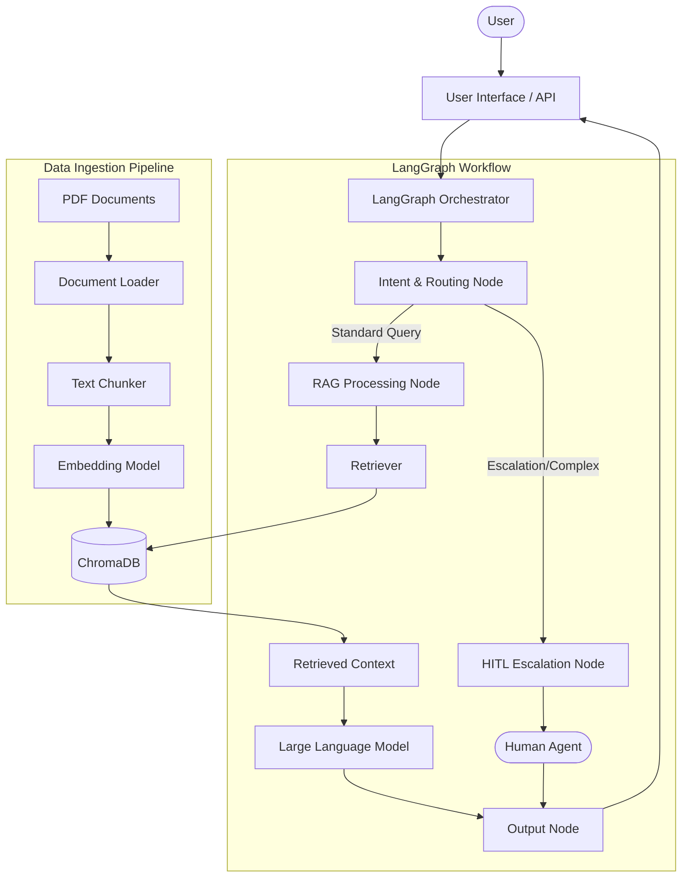

# High-Level Design (HLD): RAG-Based Customer Support Assistant

## 1. System Overview
**Problem Definition:** 
Organizations often struggle to provide instant, accurate, and context-aware responses to customer queries based on their internal knowledge bases. Traditional chatbots lack deep contextual understanding and hallucinate, while pure human support is not scalable.

**Scope of the System:**
This project aims to build a Retrieval-Augmented Generation (RAG) system that acts as a Customer Support Assistant. It ingests a PDF knowledge base, retrieves relevant context using embeddings, and generates answers using an LLM. It features a graph-based workflow (LangGraph) to route user queries based on intent. Crucially, it incorporates a Human-in-the-Loop (HITL) mechanism to gracefully escalate queries to human agents when the AI lacks confidence or the query is too complex.

## 2. Architecture Diagram

## 3. Component Description
- **Document Loader:** Reads and extracts text from PDF documents.
- **Chunking Strategy:** Splits the extracted text into manageable, overlapping chunks (e.g., RecursiveCharacterTextSplitter) to maintain context and fit within the LLM context window.
- **Embedding Model:** Converts text chunks into dense vector representations (e.g., OpenAI Embeddings or HuggingFace BGE).
- **Vector Store:** ChromaDB, chosen for its fast local retrieval and ease of setup, stores the document embeddings.
- **Retriever:** Queries ChromaDB using the user's input embedding to fetch the top-K most similar chunks.
- **LLM:** The reasoning engine (e.g., GPT-4o-mini or Llama 3) that synthesizes the retrieved chunks into a coherent answer.
- **Graph Workflow Engine:** LangGraph manages the state of the conversation and the execution sequence of nodes.
- **Routing Layer:** A conditional logic component inside LangGraph that decides whether to process the query via RAG or route it to a human.
- **HITL Module:** A holding mechanism where execution pauses or redirects to a human interface for manual resolution.

## 4. Data Flow
1. **Ingestion:** PDF -> Text Extraction -> Chunking -> Embedding -> ChromaDB.
2. **Query Lifecycle:**
   - User submits a query.
   - The query enters the LangGraph workflow and initializes the State.
   - **Intent Analysis:** The routing layer evaluates if the query is a standard FAQ (proceeds to Process Node) or needs escalation (proceeds to HITL).
   - **Retrieval (if Process Node):** Query is embedded -> VectorDB searched -> Top-K chunks retrieved.
   - **Generation:** Query + Context chunks -> LLM -> Generated Answer.
   - **Escalation (if HITL Node):** System halts/flags the query. Human agent provides the answer.
   - **Output:** The final answer is returned to the user.

## 5. Technology Choices
- **Vector Database (ChromaDB):** Selected for its lightweight, local, and open-source nature. Excellent for rapid prototyping and moderate-scale deployments.
- **Workflow Orchestration (LangGraph):** Provides fine-grained control over cyclical flows, state management, and makes implementing HITL straightforward via conditional edges and graph state.
- **LLM Framework (LangChain):** Offers seamless integration between document loaders, splitters, embedders, and ChromaDB.
- **LLM (OpenAI / Open-source):** Chosen for strong reasoning capabilities required for evaluating routing conditions and generating accurate RAG responses.

## 6. Scalability Considerations
- **Handling Large Documents:** Use asynchronous batch processing for embedding generation. Transition from ChromaDB to a distributed Vector DB (like Pinecone or Milvus) if data scales to millions of vectors.
- **Increasing Query Load:** Deploy the application behind a load balancer using FastAPI. The stateless nature of the LLM generation (with state managed externally or via Redis) allows horizontal scaling.
- **Latency Concerns:** Optimize top-K retrieval parameters. Implement semantic caching (e.g., GPTCache) so repeated questions don't require full LLM generation.
